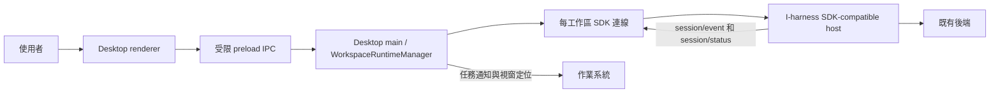

# I-harness Desktop 工作台設計（實驗分支）

**日期：**2026-09-25

**基線：**`D:\frontend-test` clone 的 `51b451395068193f4f83f33939741ed57fea1247`，本地分支 `codex/desktop-workbench`

**狀態：**前端設計方向已於 2026-09-25 確認。使用者同日另行批准新增一個後端包；其具體契約仍須獨立設計，本文不授權修改既有後端包或 SDK v3。
**產品裁決來源：**使用者指定 ZCode 為 Desktop 視覺主參照、完整日常工作台為首輪範圍、SDK wire 為接入邊界、Desktop 前端只佔 `packages/desktop` 一個包；外部依賴只用公開通用庫；OpenCode 長時間卡頓列為性能驗收；任何新增後端功能須先提案，獲批准後才以 `packages` 下的新包加入；不得推送 GitHub。

## 1. 目標與完成定義

Desktop 是讓一個人跨工作區指揮、監督和檢查 I-harness Agent 的本機工作台。**首輪完成**必須同時具備四條真實資料流程：

1. **會話：**選工作區、建立／切換耐久會話、發出提示、看流式對話、取消、重開後恢復歷史。
2. **任務：**看到會話內的 queue 和 subagent／job／workflow／schedule 任務狀態；切換任務後仍可找到當前工作。
3. **人機介入：**批准／拒絕工具請求、回答 Agent 問題；待處理項在正確會話顯示，斷線及重啟後狀態不能被猜測或靜默當成已批准。
4. **成果檢查：**能從任務定位到變動文件，閱讀逐文件變動和可支援的文件預覽，再回到會話追問。

缺少第 3 或 4 條時，可交付內部可用的階段產物，但**不得稱為首輪完整工作台**。所有可用操作須由真宿主能力決定；不以 ZCode 畫面上有按鈕作為 I-harness 已支持該行為的證據。

## 2. 明確不在首輪承諾內

- 公開遠端服務、多租戶、帳戶／訂閱、雲端同步、分享、插件市場、內嵌瀏覽器自動化、Office 編輯器、獨立互動終端及完整 Git 客戶端。
- 照搬 ZCode／OpenCode／DSH 的內部包、私有庫、產品圖標、商標或整個設計系統。採納 ZCode 的**佈局、密度與交互語言**，在本包中重新建立必要組件。
- 在 `packages/desktop` 內重做 Agent loop、provider 解析、sandbox、持久化或其他後端邏輯；Desktop 主進程只管理 SDK 進程、視窗、通知與本機 UI 偏好。
- 在已批准的新後端包之外，新增其他後端包；未經另行批准擴大既有 SDK 方法、修改 `apps/cli` 或更改既有協議版本。

## 3. 前端包邊界

只新增 `packages/desktop` 一個**前端** workspace 包。內部目錄依職責分開：

| 內部區域 | 單一責任 | 可依賴 |
|---|---|---|
| `main/` | Electron 視窗、按工作區管理 SDK 子進程、系統通知、檔案夾選擇、本機偏好 | Electron、Node、`@i-harness/sdk` 的客戶端及 wire 型別 |
| `preload/` | 驗證並暴露最小化、類型化的 renderer 命令／事件入口 | Electron IPC 型別、本包共享契約 |
| `renderer/shell/` | ZCode 風格的工作區側欄、任務中心、中央會話、右側成果工作面 | 本包的 UI 狀態與公共 UI 庫 |
| `renderer/session/` | SDK 事件投影、歷史分頁、對話與工具行、草稿及 queue／task 顯示 | 本包的 wire adapter，不直接依賴引擎 |
| `renderer/interaction/` | 待批准／待回答呈現與用戶決定；僅在已批准的後端契約可用時啟用 | 本包的 IPC 契約 |
| `renderer/review/` | 變動文件列表、diff 和預覽；僅在已批准的只讀後端契約可用時啟用 | 本包的 IPC 契約 |
| `renderer/design/` | 色彩、字體、間距、圖標與可複用基礎組件 | 公開通用依賴 |

`main/` 不把 `@i-harness/session-executor` 或其他引擎包直接拉入 Desktop；它經 SDK 客戶端與已存在或新批准的 SDK-compatible 後端宿主通信。Renderer 不取得 Node、檔案系統、模型密鑰或任意命令執行權。Electron 使用隔離的 preload、關閉 renderer Node integration，IPC 方法採明確 allowlist 並驗證參數。

**依賴原則：**React、Electron、Vite、虛擬列表、圖標等可從公開通用套件選取並在實作計畫中釘版本；`@zcode/*`、`@opencode-ai/*`、`@deepseek-ai/*` 等參考項目的內部依賴不進本倉。I-harness 自有 workspace 包不屬外部私有依賴。

## 4. 桌面資料流與生命週期

一個工作區由其規範化絕對路徑標識；Desktop 本機偏好只保存用戶曾打開的工作區、視窗幾何、側欄寬度與每工作區最後選中的會話。它**不是會話真相來源**。`main/` 在工作區首次使用時以該路徑作 `cwd` 啟動 SDK host，並使用 Desktop 管理的固定 `--session-dir`。每個活躍工作區持有自己的連線；有進行中工作或待人處理事項的連線不因切換工作區就被銷毀。會話歷史與狀態仍以後端為準。

關閉視窗時，若仍有活躍工作，Windows 桌面保留主進程並在托盤提供「顯示工作台／退出」；明確「退出」才結束 host。意外退出後，只從 durable log 恢復已記錄的內容；不推測未完成工具操作的成功與否。通知必須攜帶工作區和會話識別，點擊後回到正確位置；未獲可靠身份的事件不發可導航通知。

**首版啟動狀態：**打開應用先顯示窗口與可見載入狀態；SDK 初始化失敗呈現可重試錯誤與診斷摘要，不留白屏。未配置模型時明確顯示配置缺口，不提交會靜默失敗的提示。提供商配置完整 GUI 需要另外核實前端契約，未批准前不假裝已實現。

## 5. 畫面與交互

### 5.1 框架

- **左：工作區／任務導航。** 工作區清單在上，選中後顯示會話；每行顯示標題、運行狀態、最後活動時間。釘選和本機折疊屬 Desktop 偏好，不改後端會話資料。`session/dashboard` 的 `listingUnavailable` 必須呈現為「無法列出」，不能當作零會話。
- **中：會話。** 有文字、工具、todo、子代理與當前任務的時間線；assistant chunk 在流式期顯示，持久 `assistant/message` 到來後取代暫態內容。`step/end` 的 `refused`、`truncated`、`empty` 以不同明確狀態顯示。輸入框按會話保留草稿；發送、排隊、取消互不混淆。
- **右：成果工作面。** 預設顯示本任務可驗證的變動與輸出，按需切換檔案／diff／任務詳情；無契約時呈現具體的不可用原因，不渲染虛假的空列表或功能按鈕。面板可關閉並可調寬度。

### 5.2 ZCode 風格的具體表達

三區佈局、安靜的中性色底、清楚的白色／深色面板、緊湊但可讀的列表、低強度分界、對互動狀態使用少量語義色。淺色基準可參照 ZCode 的 `#f8f8f8` 背景、`#f0f0f0` 側欄、白色面板與約 14px 正文字級；深色需有獨立 token。設計稿記錄 token 對照，不能直接複製整份 `styles.css`。窗口控制安全區、鍵盤焦點、中文文本換行、窄窗口折疊與高對比可讀性都屬同一套設計驗收。

### 5.3 待人處理

批准和提問貼近當前會話 composer 呈現，左側任務行同步標出「等我」。每項顯示來源、具體請求、選項及當前狀態；提交後顯示送達／拒絕／失敗，不把一次點擊當成後端已接受。切換會話或視窗時保持請求歸屬；斷線後從權威 pending 列表恢復，不能只靠 renderer 暫存。該設計**依賴 §8 的待批准後端契約**。

## 6. SDK wire 投影與重連

現有 `initialize` 的 `protocolVersion` 和 capability 是啟動能力表；按 capability 顯示 create、fork、model、rewind 等入口。`session/list`、`session/dashboard` 是列表來源；`session/queue`、`session/tasks` 是具名任務來源；`session/event` 是增量通知；`session/history` 是按 `afterSeq` 獨佔游標、每頁最多 1000 條的補頁來源。

每個打開的會話先建立通知接收，再讀歷史窗口；以 `seq` 去重、按序合併。發現序號缺口、SDK 連線重建或 renderer 重載時，從最後已確認的 `seq` 分頁補齊。網路／子進程斷線時保留已讀內容但標明離線，寫操作停用，不能對未送達的批准或提示作樂觀成功。歷史讀取失敗保留可重試狀態。Session 真相不從 UI 文本反推，queue／task 狀態以宿主投影為準。

若某事件沒有可用 `seq`，只作當前連線的暫態顯示；不能把它當作已耐久補齊的確認點。SDK 返回未知的新事件類型時保留序號並以可展開的通用行呈現，不讓整個會話頁崩潰。

## 7. 長時間運行的性能設計與驗收

用戶觀察到 OpenCode 長時間使用後可能卡頓；本設計不假稱已找到其根因。Desktop 的驗收以**實際長時間場景**為準：多會話切換、長事件歷史、持續流式輸出、大工具結果、右側 diff、背景工作區並存，以及關閉／重開。

- 歷史按頁載入；可見時間線用虛擬列表，僅已展開的大工具正文才渲染。長輸出採摘要／按需展開，renderer 不同時保留每個工作區全部 DOM 與原始 payload 副本。
- 流式 chunk 以畫面幀合併投影；持久 message 到來後替換暫態行。跨任務狀態選擇器只重算受影響會話；非活躍面板懶掛載且釋放訂閱。
- 建立 100 個會話、單會話 10,000 與 100,000 事件、含大輸出及反覆切換的 fixtures；記錄 renderer heap、輸入回應、切換、滾動及長時間 soak 的趨勢。**驗收要求無隨時間單調惡化、無重複事件、無無界記憶體增長。**具體毫秒／記憶體閾值在命名硬件上的首個基線測量後，寫入實作計畫；不能把虛擬化存在本身當成通過。

## 8. 獨立的後端契約提案——等待用戶批准

### 8.1 P0：人機交互與既有 sandbox 的宿主接線

**已核實的現況：**`packages/interaction` 有 approval／question answerer seam，`SessionService.onAssembly` 可供宿主掛接；但 SDK 的 19 方法沒有待批准／待回答列表或 reply。ACP v0 也沒有 `session/request_permission` 往返。**Sandbox 本身已在 `packages/sandbox`、`sandbox-policy`、`sandbox-local`、`sandbox-windows-acl` 及 `session-executor` 實作**；`i-harness run` 會把 `--sandbox` 或已載入的 `settings.sandboxMode` 傳給執行器。缺的是當前 `i-harness sdk` 宿主的 `createSessionService` 呼叫沒有傳該選項。新後端包只需重用既有模式解析與 `AssemblyOptions.sandbox`，不得再寫一套 sandbox 引擎或政策。

**所需契約（產品語義）：**按會話取得權威 pending 請求；請求有穩定 id、種類、來源、可展示內容和合法選項；用戶提交批准／拒絕／答案後獲得明確結果；重複提交、斷線、超時、會話取消和權限收緊有可辨狀態；宿主先載入既有 settings，再按既有 `sandboxMode` 設定將模式傳給 `createSessionService`，並報告與執行一致的**既有** sandbox 模式。任何失聯或無回答器都 fail closed。

### 8.2 P0：成果檢查只讀面

**已核實的現況：**SDK 能提供對話和工具事件，`rewind/plan` 有專用文件操作視圖；沒有一般「任務修改文件列表＋逐文件 diff＋文件預覽讀取」操作。

**所需契約（產品語義）：**以工作區及任務／會話為範圍返回變動文件、變動種類與可讀預覽；讀取前驗證路徑屬工作區，提供有界內容和明確截斷標記；未追蹤、二進制、已刪除與與外部編輯衝突時不捏造 diff。讀取為只讀，不自動執行 Git 操作或修改文件。

### 8.3 後端包界線

使用者已於 2026-09-25 批准新增**一個** `packages/*` 後端包承載 P0。它由 Desktop 經類型化 SDK-compatible 協議消費；不得藏在 `packages/desktop`，亦不得默改既有 SDK v3 方法的語義。責任是 Desktop 所需的宿主與交互／審查投影，以及把**既有 sandbox** 選項傳入執行器；需在獨立後端 spec 核對如何複用現有 `SessionService`／SDK server 而不複製 CLI 裝配。若詳細設計發現必須修改既有後端包或 CLI，應停下來重新向使用者提出具體變更，不能把它當作本次新包批准的隱含授權。

Provider 設定、附件上傳、全文搜尋、互動終端與瀏覽器是後續候選；是否需要新契約須按對應畫面另量。本 spec 不授權它們。

## 9. 分段交付與驗證

| 階段 | 可驗收成果 | 放行條件 |
|---|---|---|
| D0：桌面殼與接線 | `packages/desktop` 可開啟窗口、選工作區、以受限 IPC 連 SDK；可見初始化錯誤 | 不需新增後端；有真 SDK handshake 與程序關閉測試 |
| D1：會話／任務 | 耐久會話、流式 timeline、歷史補齊、queue／tasks、取消與多工作區切換 | 真 SDK e2e；**發送可執行工具的提示前，新宿主須已接通既有 sandbox 模式**；斷線恢復、重複事件與未知 capability 的測試 |
| D2：人機介入 | 待處理中心、批准／拒絕、問題回覆與通知回返 | 新後端包已獲准；**§8.1 詳細契約仍需獨立設計、審閱、實作並驗證**；fail-closed e2e |
| D3：成果檢查 | 任務文件變動、diff／預覽與追問流程 | 新後端包已獲准；**§8.2 詳細契約仍需獨立設計、審閱、實作並驗證**；有界輸出和路徑測試 |
| D4：首輪完成 | D0–D3 連貫使用、ZCode 風格視覺校驗、長會話性能與重啟恢復 | 具名 Windows 環境的端到端與 soak；沒有假的功能入口 |

**測試策略：**投影邏輯以確定性事件序列測試；main／preload 的 IPC 用契約測試；真 SDK host 的建立、發送、補頁和取消做端到端；批准／審查待後端獲批後用真宿主測。視覺需檢查淺／深主題、窗口縮放與三區折疊。功能和長會話性能通過前，不擴展高級面板。

## 10. 風險、判斷與審核點

- **首輪範圍對後端 P0 有硬依賴。**新後端包雖已獲准，具體契約及實作未完成前只能交付 D0 或 D1 的非執行型畫面；不能讓沒有 sandbox 接線的 SDK 宿主執行 Desktop 工具任務，也不能把 UI 佔位當作「完整工作台」。
- **桌面關閉語義是產品決定。**本文預設 Windows 活躍任務關窗後留在托盤，明確退出才停止。用戶若不要托盤續跑，D0 的生命週期和通知策略須調整。
- **會話來源要忠實。**SDK dashboard 不帶 cost／team/cross-machine member，冷會話 tasks 可為空；UI 不補造數值。未配置模型和未掛能力是可見狀態。
- **包的複雜度。**單一 `packages/desktop` 是發佈和依賴邊界，不意味所有邏輯集中在一個 `App.tsx`；內部按責任拆分並監測長期性能。
- **推送隔離。**本地 clone 的 `origin.pushurl` 為 `no-push://disabled`；本設計和後續實驗只做本機提交，不創建 PR、不推送、不改 `D:\I-harness-main`。

## 11. 核對來源

- 現有線路：`packages/sdk/src/server.ts`（19 方法、能力、歷史）、`packages/sdk/src/protocol.ts`（DTO）、`packages/sdk/src/client.ts`（stdio 客戶端）、`packages/session-executor/src/service.ts`（service 與 `onAssembly`）、`packages/interaction/src/index.ts`（answerer）、`packages/acp/src/index.ts`（v0 權限範圍）、`apps/cli/src/index.ts`（SDK 宿主）。
- 歷史立場：`docs/handoff/2026-09-17-remove-tui-and-web-frontends.md` §1／§2.4，`docs/audit/2026-08-31-fiveway-comparison.md` §4，`docs/superpowers/specs/2026-09-15-backend-polish-roadmap-design.md` §5 Q6。
- UI 參照：`D:\agent-complete\ZCode-main\packages\ui\src\app-shell\WorkspaceShellLayout.tsx`、`WorkspaceSidebar.tsx`、`styles.css`；`packages/desktop/src/main/desktopNotifications.ts`、`desktopTray.ts`；OpenCode `packages/app/src/pages/session`；DSH `packages/client/ui-conversation/README.zh.md`。
