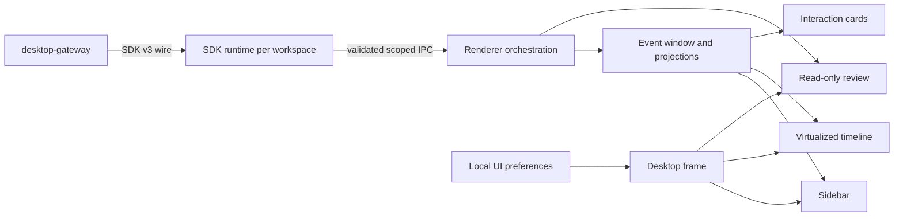

# I-harness Desktop D0–D4 Visual Fidelity Redesign

**Date:** 2026-09-26  
**Status:** Approved in chat; awaiting written-spec review  
**Reference:** ZCode 3.14.0 Desktop observed from a running Windows Electron instance

## 1. Objective

Turn the existing D0–D4 implementation into a complete daily Desktop workbench while preserving its backend and safety behavior.

The workbench must let a local user open and switch workspaces; create, resume, and monitor sessions; read long conversations and tool activity; answer questions and approvals; inspect task progress; and review workspace changes without reading backend identifiers.

The visual target is a high-fidelity reproduction of the observed ZCode Desktop: dark material hierarchy, geometry, density, typography scale, task-centered left sidebar, quiet conversation surface, bottom composer, on-demand right work pane, empty states, and interaction feedback. I-harness implements that experience through its own components and data contracts.

## 2. Scope and constraints

- All product changes stay inside `packages/desktop`.
- The approved `packages/desktop-gateway` contract remains the backend boundary.
- Desktop main owns the SDK child process, native window, notifications, window controls, and local UI preferences.
- Renderer does not implement Agent loop, provider resolution, sandbox, persistence, Git mutation, or other backend logic.
- No private package dependency may be introduced; public general-purpose dependencies are allowed.
- No public remote service, multi-tenant behavior, account system, subscription billing, or cloud sync is introduced.
- GitHub push remains disabled; `D:\I-harness-main` remains untouched; the app remains unsigned.

## 3. Research evidence

The reference app was launched from `D:\agent-complete\ZCode-main` using its official Desktop development path. The study covered onboarding, empty workbench, nested workspace and task navigation, a long conversation, tool activity, the bottom composer, the review pane, and settings.

The current packaged I-harness Desktop was also launched and captured. The detailed report and screenshots live outside the repository at:

`C:\Users\inkik\.codex\visualizations\2026\09\24\01a0d375-9bbd-74b3-806c-511643bddbdc\zcode-research\zcode-d0-d4-gap-report.md`

## 4. Reuse strategy

### 4.1 Existing I-harness code retained

| Area | Existing implementation retained |
| --- | --- |
| SDK lifecycle | `src/main/sdk-runtime.ts` |
| Scoped IPC and wired-send gate | `src/main/ipc.ts` |
| Workspace catalog | `src/main/workspaces.ts` |
| Event replay, dedupe, cursor, and 20k cap | `src/renderer/session/event-window.ts` |
| Session history and projection | `src/renderer/session/history.ts`, `project.ts` |
| Long-session virtualization | `src/renderer/session/Timeline.tsx` |
| Bounded per-session drafts | `src/renderer/session/Composer.tsx` |
| Send availability and reason | `src/renderer/session/send-gate.ts` |
| Pending interaction normalization | `src/renderer/interaction/pending.ts` |
| Approval and question replies | existing bridge and app handlers |
| Read-only review contract | `src/renderer/review/ReviewPane.tsx` types and app handlers |
| Packaging and bundled gateway | existing package scripts |

These modules may receive narrow presentation interfaces. Their ownership and behavior remain unchanged.

### 4.2 Existing components reorganized

- `Workbench.tsx` becomes the desktop shell and panel coordinator.
- `WorkspaceSidebar.tsx` and `TaskList.tsx` merge visually into one nested sidebar while keeping separate data inputs.
- `Timeline.tsx` keeps virtualization and replaces its generic row presentation.
- `Composer.tsx` keeps draft and submit behavior and receives a new visual shell.
- `PendingPanel.tsx` keeps reply behavior and becomes an attention surface.
- `ReviewPane.tsx` keeps its read-only contract and becomes an on-demand side pane.

### 4.3 ZCode reuse boundary

ZCode is Apache-2.0. Direct redistribution of substantial source requires retaining the Apache license, relevant notices, attribution, and modification notices.

This implementation will:

1. reproduce the observed layout, proportions, density, typography, interaction patterns, spacing relationships, and state hierarchy with high visual fidelity;
2. reimplement every required surface against I-harness interfaces, including the window frame, window controls, collapsible side pane, compact activity rows, nested sidebar, conversation timeline, composer, interaction cards, review pane, and settings shell;
3. use I-harness-owned components for ZCode's large or tightly coupled components. Their unsuitable implementation dependencies do not remove the corresponding visual surface or user workflow from scope;
4. avoid importing ZCode's store and service layer. Its sidebar, task item, Git pane, and composer are tightly coupled to ZCode state and services.

The implementation rule is therefore: reproduce the product experience, then connect it to I-harness state. A ZCode component that cannot be moved directly is rebuilt with the same visible purpose and interaction quality using I-harness data, rather than simplified away.

No ZCode logo, trademark, provider-specific UI, private dependency, telemetry, account flow, subscription flow, remote workspace model, terminal, or browser implementation is copied.

If a ZCode fragment later proves worth copying verbatim, implementation pauses before the copy and adds the required Apache license and notice material in the same change. The current design requires no verbatim ZCode source.

### 4.4 Desktop state, services, and localization

The Desktop renderer uses a small Zustand store for UI-owned state only:

- selected workspace and session;
- sidebar expansion and narrow-window drawer state;
- active workbench surface and review-pane visibility;
- local settings route;
- per-surface ephemeral selection such as the chosen review file.

SDK events, session history, pending interactions, provider facts, plugin facts, terminal processes, telemetry, and sandbox state do not become duplicate Zustand authorities. Service hooks wrap the preload bridge and expose typed operations to components. Store selectors remain narrow so streaming updates do not rerender the entire shell.

Localization begins in this redesign inside `packages/desktop`. New visible strings use typed message keys rather than component-local literals. The first dictionaries are Traditional Chinese and English, with a Desktop-local locale preference and system-locale fallback. Backend codes and reason values remain stable protocol values and are translated at the presentation boundary.

### 4.5 Existing backend capability inventory

| Surface | Existing backend | Desktop status for this design |
| --- | --- | --- |
| Plugins and marketplace | `packages/plugin-registry` supports marketplace sources, catalog, install, uninstall, enable, disable, skills, commands, agents, hooks, and MCP materialization | No Desktop gateway methods yet; requires explicit backend approval before wiring |
| Providers and models | `packages/provider`, `provider-runtime`, `credentials`, and provider adapters support routes, discovery, model rows, credentials, and runtime resolution | Gateway initializes provider runtime and reports session model state; management methods are not exposed |
| Terminal | `packages/terminal` owns a real `node-pty` service with open, send, read, signal, close, resize, and list | No Desktop wire; an interactive surface must preserve session ownership and sandbox escalation |
| Browser | `packages/web` supplies bounded `webfetch` and provider-backed `websearch` tools | No interactive browser/CDP surface; excluded from this redesign |
| Telemetry | `packages/telemetry` supplies local events, sinks, JSONL, and metrics | No Desktop query wire; the redesign uses existing session state and does not invent analytics |
| Tab/workbench | No backend object is required | Implemented as Desktop-local Zustand state and component composition |
| Account and provider usage | No shared subscription or usage account contract | Deferred; future provider-specific adapters may expose official read/reset APIs without selling subscriptions |
| Remote workspace | Deliberately unnecessary for this local product | Excluded |

The official Claude plugin directory uses the same plugin ecosystem shapes: `.claude-plugin/plugin.json`, optional `.mcp.json`, commands, agents, and skills. Desktop UI may therefore present I-harness plugin-registry data without adopting ZCode state or services.

## 5. Information architecture

### 5.1 Desktop frame

The custom title bar contains a stable drag region, current task title, review toggle, and minimize, maximize or restore, and close controls. Interactive elements opt out of the drag region. Window control IPC is sender-scoped and affects only the sender's BrowserWindow.

### 5.2 Left sidebar

The 288px sidebar owns new task, open workspace, workspace groups, sessions nested below their workspace, meaningful status indicators, and settings.

A session row shows a human-readable title with a localized untitled fallback, an attention or running indicator when relevant, and relative activity time when available. Raw session IDs are excluded from visible labels.

### 5.3 Main conversation surface

The main surface contains a compact header, virtualized timeline, pending interaction cards, and bottom composer. Content width is capped for reading when the right pane is closed.

### 5.4 Right work pane

Review is closed by default. Opening it creates a resizable right pane with a tab header, refresh action, changed-file list, and selected diff or preview. Empty and unavailable states remain distinct. Closing it restores conversation width.

## 6. Visual system

The default theme is dark:

- near-black canvas;
- one-step-lighter sidebar;
- raised composer and cards;
- low-contrast neutral borders;
- high-contrast primary text;
- lower-contrast activity text;
- restrained blue focus and selection;
- amber attention, green success, and red error or deletion.

Typography uses a 14px system UI base with Traditional Chinese fallbacks, 15px conversation copy with approximately 1.65 line height, 12px metadata, and 13px system monospace code. Paths and code handle overflow safely.

Only short opacity and panel-width transitions are allowed. Reduced motion disables them. No backdrop blur, continuous animation, animated background, or large shadow stack is introduced.

## 7. Components

### 7.1 DesktopFrame

Owns title bar and pane layout, drag regions, responsive panel decisions, and preload window-control calls. It receives presentation state and owns no SDK facts.

### 7.2 WorkspaceTaskSidebar

Renders workspaces and nested sessions, selects them, requests open workspace and create session, and shows attention state. It receives fetched dashboard data and does not persist backend state.

### 7.3 ConversationTimeline

The existing virtualizer remains the owner of mounted-row bounding. Rows become:

- user message: compact right-aligned surface;
- assistant message: Markdown document flow;
- reasoning or other event: muted activity row;
- tool call: icon, action label, state, and optional detail;
- large tool result: folded by default;
- outcome: success, cancelled, interrupted, or error summary.

Markdown uses a public renderer with raw HTML disabled and optional GFM support. Code uses semantic blocks and CSS rather than a heavyweight highlighter.

### 7.4 WorkbenchComposer

Bounded drafts and confirmed-send clearing stay unchanged. The composer shows workspace context, sandbox or permission status, current model label when reported, and send or stop.

Controls without a backend contract are read-only. Enter sends when allowed and IME composition is inactive; Shift+Enter inserts a newline; Escape does not discard the draft; disabled send exposes the existing reason.

### 7.5 InteractionCard

Approvals show request label, reason, approve and deny. Questions show prompt, supplied choices or a text answer, and explicit submit. A failed reply keeps the card and answer visible.

### 7.6 ReviewSidePane

The contract stays read-only. File rows show path, status, and available actions. The selected diff is parsed line-by-line into hunk, addition, deletion, and context rows with safe plain text, line numbers when derivable, and truncation information.

Binary, missing, deleted, untracked, no-head, no-diff, and not-git explanations stay distinct.

### 7.7 Local settings

The first settings surface covers Desktop-owned language, appearance, sidebar visibility, review behavior, existing notification preference, and window preference reset. The settings navigation is extensible through service-backed sections; it does not show dead controls for unavailable services.

Plugin marketplace and provider/model management can be added to this settings shell after their Desktop gateway contracts receive explicit backend approval. Account usage is a later provider-specific surface. Subscription creation, cloud settings, and remote workspace settings remain excluded.

## 8. Data flow and ownership

Backend facts remain in SDK or gateway. Renderer state is limited to selection, drafts, expansion, pane visibility, and display preferences.

## 9. Backend boundary and deferred model picker

No backend addition is required for this redesign.

A real model picker is deferred because the current contract does not provide an authoritative model list, provider availability, or a session model update operation. The current model remains a read-only host-reported label. Model selection requires a separately approved gateway contract.

## 10. Responsive behavior

- 1180px and wider: sidebar, main surface, optional right pane.
- 760–1179px: sidebar and main; review overlays or replaces part of main.
- Below 760px: sidebar becomes a drawer and one primary surface is visible at a time.
- Composer labels collapse before controls wrap unpredictably.

The packaged app is verified at 1320×800, 1024×720, and a narrow viewport.

## 11. Errors, reconnect, and safety

- Offline and reconnecting appear in the header and disable sending through the existing gate.
- Workspace launch failure stays local to that workspace and exposes retry.
- Session failure leaves sidebar navigation usable.
- Review failure remains inside the right pane.
- Interaction reply failure keeps the request visible.
- Cancel never fabricates completion.
- Replayed and live events continue to deduplicate by sequence.

## 12. Performance

- Keep `@tanstack/react-virtual`.
- Preserve the 20,000-event cap and requestAnimationFrame assistant batching.
- Do not mount review content while closed.
- Memoize Markdown and diff parsing per stable payload.
- Do not add Monaco, Shiki, a second global store, an IDE framework, or a component suite.
- A material long-session regression must be resolved before completion.

## 13. Testing and visual verification

Behavior tests cover nested sidebar selection, untitled fallback without visible raw IDs, composer keyboard behavior, disabled-send reason, sender-scoped window controls, review open and close, diff classification, failed interaction replies, narrow layout, and all existing event, reconnect, cancellation, approval, review, and packaging contracts.

Behavior changes follow test-first development. CSS values and human prose do not receive source-text tests.

The real Electron app must be built, run, and captured in these states:

1. empty workspace;
2. selected session;
3. long conversation with tools;
4. pending approval;
5. pending question;
6. review with no changes;
7. review with a real diff;
8. narrow window.

Screenshot inspection is part of acceptance.

## 14. Acceptance criteria

1. The app opens into a coherent dark Desktop workbench.
2. Workspace and session navigation occupy one left sidebar.
3. Empty state allows immediate task creation.
4. Raw session IDs and event payloads are absent from normal presentation.
5. Long conversations remain virtualized and readable.
6. Pending approvals and questions are unmistakable and actionable.
7. Review consumes width only when opened.
8. Diff and preview remain lightweight and readable.
9. Backend semantics and safety gates remain unchanged.
10. Desktop tests, typecheck, build, package smoke, real-gateway E2E, and long-session profile complete with recorded evidence.
11. No GitHub push occurs.
12. The empty workbench, active conversation, tool activity, composer, review pane, and settings shell visibly match the reference hierarchy and density; using different internal components is not grounds for reducing the visual or interaction target.
13. New visible copy is served by the Desktop-local typed i18n catalog, with Traditional Chinese and English dictionaries.
14. Zustand contains only UI-owned state; backend facts continue to come from typed service hooks over the existing bridge.
