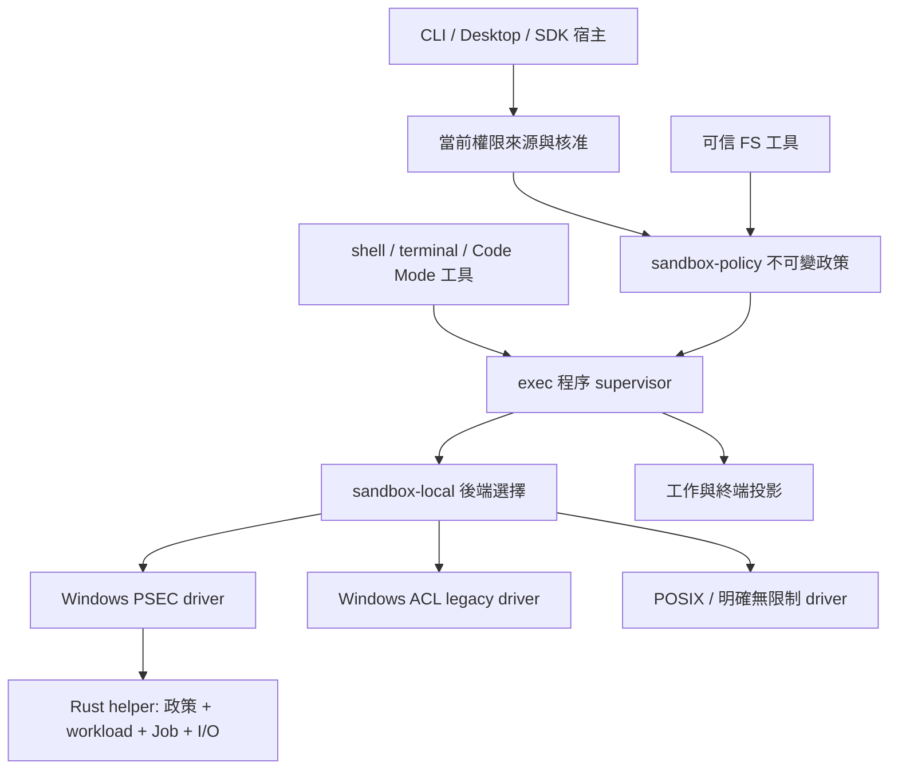

# I-harness 沙箱套件重新設計提案

日期：2026-10-07（Asia/Hong_Kong）

狀態：**使用者於 2026-10-07 確認套件化方向並授權開始實作**。本文件為實作設計依據；各阶段需獨立驗收，不表示 PSEC 相容性、強制效果或安全邊界已完成驗證。

基線：`main` 的 `020e08367f680b96cdfbc591aff3d1e90ce264b5`。參考為 Codex CLI `v0.160.0` 與它固定的 Microsoft MXC `6cd3d58f05d3447e67109cfb75e042803b843ca4`。

## 1. 目標與限制

目標是讓政策、平台強制、程序樹及輸出有明確且一致的責任；受限 Bash／Node 是新後端需要證明的能力。保留多工作區、外部來源讀取、逐呼叫核准、背景任務、PTY、取消、超時、輸出保留與權限收回。

- 不建立本機沙箱帳戶、SYSTEM 排程、Windows 服務或要求提升權限。
- 不修改參考專案或外部來源的 ACL，不透過 Low 標籤扩大寫入範圍。
- 執行開始後，後端、政策和命令身分固定；失敗不能暗中轉成完整存取或換更寬的後端。
- 外部參考在受限政策中維持唯讀。原有 `danger-full-access` 必須清楚表示不具備 OS 寫入隔離；若宿主要求不可放寬的唯讀來源鎖，就不能選用完全無限制的執行 driver。
- 只在可滿足要求的後端啟動。PSEC 功能發現、原生行為驗證和安全成熟度分別記錄。

## 2. 現況與需要改變的邊界

| 現有位置 | 現況 | 重新設計要求 |
| --- | --- | --- |
| `packages/sandbox/src/index.ts` | 同步 `confine(argv, policy) → ConfinedArgv`；能力主要為 `readIsolation` | 契約能表達非同步準備、真正的 workload handle、政策資源與清理結果 |
| `packages/sandbox-policy/src/index.ts` | 每次呼叫解析 mode 與 workspace roots | 編譯可讀、可寫、拒絕、平台需求及有版本的權限快照 |
| `packages/exec/src/index.ts` | Node spawn、pipe、串流、背景工作與 taskkill | 成為共同程序 supervisor，控制真正的執行樹，而非只認識 wrapper PID |
| `packages/terminal/src/service.ts` | 獨立 node-pty 啟動與 registry | 透過相同 runtime 啟動 PTY，維持終端 view、尺寸與輸出游標 |
| `packages/session-executor/src/assembly.ts` | 組裝平台 provider，另持有 Windows raw backend 的 dispose | 組裝服務，不保管某個平台 backend 的例外清理方式 |
| `packages/jobs` | 子代理／工作事件投影 | 繼續作投影，不當作原生 Windows Job 或第二個程序 registry |

現有逐呼叫政策、準備時命令綁定和 scoped exec 具有價值，需迁移而非繞過。`undefined` 不能同時表示「從未綁定」與「綁定已撤銷」；權限來源需要明確狀態，避免撤銷後退回舊 workspace。這是新契約要求，尚未判定目前所有宿主 guard 是否都會阻止該回退路徑。

## 3. 比較的架構

| 方案 | 優點 | 成本／限制 | 結論 |
| --- | --- | --- | --- |
| 共同政策與程序 runtime，平台 driver 可替換 | policy、pipe／PTY、背景工作和清理共享契約；Windows 可走嚴格 PSEC | 改動共用執行介面；需要平台契約測試與 native helper 發行流程 | **建議** |
| 直接把整套 MXC TypeScript SDK 當共用執行器 | 接入較快，有現成跨平台 API | dispatcher fallback、政策成熟度與前景結束即清除子孫的語意不符合 IH；帶入較大的信任範圍 | 不作核心架構 |
| 只重新整理現有 ACL runner | 改動較小，保留已測 native shell 路線 | 受限 MSYS／Node 管線問題仍在；無法補足 argv seam 的政策資源生命週期 | 保留為 legacy driver |

## 4. 套件切分

主要切分為六個角色，盡量沿用已有套件，不另建立第二個 job registry。

### 套件維護硬性規則

使用者於 2026-10-07 再次指定：本次開發持續採用 `packages`，以方便維護。這是設計與實作驗收的必要條件。

- 每個套件有自己的 `package.json`、公開 `exports`、型別檢查及測試入口；套件內部再按責任拆成小模組。
- 跨套件只透過公開 API 與 `workspace:*` 依賴；不跨包匯入 `src`、不靠相對路徑讀取其他套件私有檔案。
- 共用契約放在 `sandbox`；Win32 HANDLE、PSEC ABI、Rust helper、原生 transport 和原生 build／artifact manifest 收在 `sandbox-windows-psec`，不洩漏到 `exec`、工具層或 UI。
- `exec` 依賴平台中立契約，平台 driver 依賴同一契約；driver 不反向依賴 `exec`／`shell`／`terminal`。`session-executor` 是組裝根，避免循環依賴。
- `shell`／`terminal` 的模型或 UI 介面與原生執行實作分離。`jobs` 只投影事件，實際程序 registry 維持單一 owner。
- 套件公開介面須有 consumer／contract 測試，原生套件另外保有 Windows 實測 gates；型別或 fake driver 通過不代表 OS 強制效果已驗證。
- 每個遷移階段須標明產出／消費介面、相容 adapter 的使用者與移除條件。暫時 adapter 不能成為永久的第二條啟動路徑。
- 新套件／公開 API／原生 artifact 要同時接入 CLI 與 Desktop 的建置與發行驗證；執行時不下載或編譯 helper。

實作計畫按套件與可獨立驗收的階段拆分。每一步都檢查套件依賴方向、公開介面、測試與完整資源關閉；不把整套平台政策塞回 assembly 或單一大型 entrypoint。

| 套件 | 責任 | 不承擔的工作 |
| --- | --- | --- |
| `@i-harness/sandbox` | 共用政策／能力／錯誤／backend／lease／執行 handle 型別，政策需求協商 | 不依賴 session event、Node ChildProcess 或 Win32 FFI |
| `@i-harness/sandbox-policy` | 從宿主、當前專案成員、角色與單次核准編譯不可變政策；提供可信 FS 工具的路徑裁決 | 不建立程序，不根據 cwd 自行新增授權 |
| `@i-harness/exec` | 唯一程序 supervisor；pipe、PTY、串流、背景 registry、promotion、timeout、cancel、drain 和關閉 | 不實作平台 ACL 或 PSEC ABI |
| `@i-harness/sandbox-local` | 本機後端組裝與選擇，POSIX／明確無限制 driver 的接線 | 不丟棄底層 lease／dispose，不在執行失敗後換後端 |
| `@i-harness/sandbox-windows-psec`（新增） | TS driver、版本化 transport、Rust helper、PSEC policy 建立與真正 Win32 workload handle | 不走 AppContainer／SBOX／DACL／learning-mode fallback，不作佈建 |
| `@i-harness/sandbox-windows-acl`（既有） | 作明確的 legacy driver，宣告現有能力與相容性限制 | 不冒充 PSEC，不把目前使用者 SID 加入寫入限制來換取相容性 |

`shell` 保留命令方言、executable discovery、核准解析及模型工具介面；`terminal` 保留終端 UI 所需 view／cursor／resize；兩者都透過 `exec`。Code Mode 與插件呼叫既有工具或受控 exec，不能取得另一條 raw spawn 捷徑。可信 `fs` 工具仍在宿主內執行，以同一政策來源做逐操作裁決，不把宿主 I/O 假裝成已經在 PSEC 中。

桌面由人類直接開啟的終端保留不同的 owner 與明確宿主權限，不會因共用 runtime 而變成代理的完整存取旁路。子代理執行也須在 launch 時攜帶實際 session ID 與 parent lineage，不能只把父 assembly 的工作記錄複製到其他 owner。

## 5. 政策與權限快照

提議保留使用者可見的三種 mode，內部採用一個共用 `CompiledSandboxPolicy`，包含：

- 明確的 `authorityState`：`unbound`、`bound`、`revoked`；owner／session／project ID 與 scope revision。
- 絕對且正規化的命令 cwd、policy cwd；cwd 只描述執行位置，不授予寫入權。
- 可讀／可寫／拒絕路徑、外部參考唯讀鎖、受保護 metadata、支援的網路及 UI 要求。
- helper/runtime 只讀來源與 scratch 需求，須明列；初版保留現有唯讀語意，不默默增加 child 的 temp 寫入權。
- 與單次核准相容的 policy fingerprint；含 mode、有效根集合、reference locks 和必要宿主要求。

準備命令時，同時綁定 executable、精確 argv、argument encoding、cwd、過濾後 environment、政策 fingerprint、後端及 helper 版本。核准等待期間不重選方言或 executable。派送前重新檢查當前權限是否仍包含该份批准內容；撤銷或縮窄使準備結果失效，回傳可理解的重新準備原因。

政策變寬不會改變已啟動程序的舊政策。根目錄移除或 mode／角色縮窄時，supervisor 找出不再被允許的 active leases，先停止接受新操作、取消並等待受影響執行樹排空，再確認撤銷完成。僅讓下一次 launch 讀新政策不足以收回已運作程序的權限。

## 6. 執行契約與資源擁有者

以下描述完整目標契約。第一階段已提供 `ExecutionBackend`、`PreparedExecution`、基礎 `ExecutionHandle`、不可變政策與共用 admission；workload I/O、程序 registry 和正式 driver 依後續計畫接入：

- `ExecutionBackend.probe()`：回傳 host availability、政策 primitives、transport 與生命週期支援，附診斷與版本。
- `ExecutionBackend.prepare(request, policy)`：驗證並回傳 `PreparedExecution`；沒有暗中縮減／放寬政策。
- `PreparedExecution.commit(validateAuthority)`：完成非同步準備後，在可信 validator 的最後權限 fence 重新驗證；driver 只消費一次準備結果，再啟動並回傳 handle。不是可序列化授權密鑰，也不代表 JavaScript callback 本身就是原子 OS 啟動。Native driver 的 suspended child、Job 與 resume 順序另作實測。取消或失效的準備結果必須 `rollback()`。
- `ExecutionHandle`：工作負載 stdin／stdout／stderr 或 PTY stream、`resize`、`rootExited`、`settled`、冪等 `cancel(reason)` 和 `release()`。
- `settled`：整個執行樹結束、輸出已 drain／依明確規則丟棄、政策與 native 資源已釋放；不能等同 Node wrapper 的 `close`。

Root 的 exit status 讀取失敗與執行樹未結束須分開：狀態未知用 `exitCode: null` 及 driver 已遮蔽敏感內容的 observation diagnostic 表達；只有 tree emptiness 與 I/O 已確認後才能關閉資源。不能因固定的 root observation promise 拒絕，而永久保留一棵已排空執行樹的資源。樹已確認為空或進入資源關閉後，不得再啟動另一個 native termination；取消需加入同一個清理結果。

Node process、POSIX process group、Windows Job、PSEC handle 與 ConPTY 都由其 driver 處理；共同層只操作平台中立 handle。共同的 completion receipt 包含實際後端、政策 ID、是否已 resume、root exit、tree settlement、drain、release 結果及錯誤階段。

`ExecService.runBackground` 與 `TerminalService.open` 目前是同步 API，新的準備流程必須明確遷移為可等待的 launch；回傳值區分準備中、已運作與失敗，不能把尚未獲得 confinement 的 job ID 當成 running。原有外部 DTO 若需相容，adapter 必須明確表達狀態及錯誤，不另建一個失去 owner 的背景啟動鏈。

前景、背景、串流消費者和 PTY 使用同一個 supervisor。前景轉背景只把同一個 handle 留在 registry 中，不重新啟動、不重建政策。`@jobs` 與桌面 task view 消費事件，不能另保管一份 native ownership。

## 7. Windows 原生邊界

建議 TS driver 加一個預編譯 Rust executable，初版每個執行樹一個 helper。Rust helper 以明確擁有權管理 PSEC、程序／thread／Job、pipe 或 ConPTY 與 buffer；讓 native 失敗不拖垮 Node/Electron。Node FFI 可以作較短的實驗，但不作建議的正式資源邊界。

Native request 使用版本化、有限大小的私有 transport，傳入精確命令、policy、owner、I/O 模式與 lifetime。helper 的 status/control 與 workload I/O 分開；孩子只繼承白名單中的 workload handles，不能持有控制 pipe、host file handle、PSEC 或 Job handle。錯誤走結構化 status channel，工作負載不能靠輸出錯誤字串冒充 launcher failure。

helper 以已安装套件中的絕對路徑與 artifact manifest 定位，綁定 protocol／架構／digest；不從工作區 PATH 尋找，不在執行時下載或編譯。helper 和依賴必須在 child 可寫根之外，或由政策明確保護。平台 API 由受信 system location 載入。

Environment 必須忠實傳递過濾後的值，包含明確空環境；若採用的 SDK 把空 list 換成 profile 預設值，就拒絕該請求，直到 direct engine 能保留其語意。Volume root 展開與 deny-glob 解析的 snapshot 限制也須明列，不能把新掛載／新目錄自動加到已啟動政策中。

建立政策後，先建立 suspended child，再完成安全環境、handle 清單及 Job 所有權，全部成功才 resume。失敗路徑必須處理未加入 Job 的 suspended child。取消／timeout／輸出停止共享一條有原因分類的清理路徑；最終 acknowledgement 代表排空已完成，清理不確定時回報獨立的 incomplete-cleanup 狀態。

## 8. 背景任務與權限生命週期

兩種明確 lifetime：

- `complete-tree`：root 結束後终止剩餘子孫，排空後完成。
- `retain-tree`：root 結束只是一個事件；registry 持續擁有子孫、政策、Job 與輸出，直到執行樹結束、期限到期或取消。

持續背景工作需要 owner、期限和資源上限；宿主控制通道死亡時，kill-on-close Job 作崩潰後備。正式關閉與撤權仍要顯式 kill／wait／drain／release。不得直接使用目前 MXC runner「root 結束即終止子孫」的語意來宣稱 IH 背景保留已完成。

## 9. 能力、驗證與成熟度

將三類資訊分開：

1. **Host discovery**：API-set、exports、query flags、OS／架構與可用 transport。
2. **Behavior qualification**：哪些政策與執行 profile 的 native 正／反例已通過，綁定 compiler revision、helper digest、SDK revision 和 OS。
3. **Assurance**：正式 backend、experimental、上游預覽限制及不支援的需求。

本機目前只有 discovery：API-set 與 Create／Query／Close 存在，Query HRESULT=0、flags=`0x3`、拒絕路徑支援=true。尚未建立 PSEC 或運行 child。不能据此宣告 `readIsolation: true`、Bash／Node 相容或正式安全邊界。

Codex 固定的 Microsoft MXC README 記載早期預覽、已知過度寬鬆政策及當前 profiles 不應作安全邊界。若借用該 SDK，第一版只能明確 experimental；自行限縮政策也需審查與原生證據，不能由通過少量測試消除上游成熟度限制。

`auto` 只在 launch 前，在**能完全滿足政策且符合所要求成熟度**的後端中選擇。手動 `windows-psec` 為嚴格選擇，無法支援就拒絕。命令失敗不換後端，不走完整存取、不走 DACL mutation、不使用 permissive learning。

## 10. 驗收矩陣

| 群組 | 必須證明的結果 |
| --- | --- |
| 基本原生能力 | 普通使用者 create／close、正常 child launch；fault injection 覆蓋 policy、suspended spawn、Job、resume；不發生無限制命令執行 |
| 工具鏈 | 真正 Git Bash／MSYS、cmd、兩種 PowerShell、Node 同步／非同步 pipe 和多層子孫；適用的 npm／tsx／esbuild 工作負載 |
| 檔案邊界 | 正向區內寫入與反向外部修改／建立／刪除／rename／atomic replace；外部參考內容與 ACL 不變 |
| 角色與權限世代 | `[A,B] → [A]`、可寫→唯讀、並行會話／private temp、已建立的檔案、live handle 和 active job 撤權；ack 後無舊權限繼續寫入 |
| 路徑與 metadata | junction／reparse race、hardlink、短路徑、case／UNC／device path／ADS 等支援範圍；不支援的型態拒絕；受保護資料不被可寫根重開 |
| 程序與 handles | child／grandchild、breakaway、helper／宿主存取、繼承或複製 host handles；由真實 kernel handle 和 Job 計數核對 |
| I/O 與背景 | 大量同時 stdout／stderr、stdin 提早關閉、root 先退出、promotion、timeout／cancel race、宿主／helper 死亡；分別核對 tree、drain 和 release |
| PTY | 原生隔離的啟動、輸入、resize、interrupt、close；unsupported 時不能退回無限制 node-pty |
| 網路 | 若宣告支援，使用可控 fixture 測 direct IPv4／IPv6、DNS、ingress／loopback／proxy；只能做到雙向 loopback 時拒絕單向要求 |
| 發行 | 新機普通使用者、helper 缺少／不符 digest／架構／protocol、固定載入位置和 build provenance；不執行安裝佈建 fallback |

## 11. 遷移順序

1. 確定共用政策、authority state、執行 handle 和 receipt 契約；以假 driver 做平台中立生命週期契約測試。平台 driver 同時跑其自己的原生 gate，不能用假 driver 證明強制效果。
2. 補充 workload transport 與唯一 `exec` supervisor，先用有延遲的假邊界驗證 preparation、取消與撤權的順序。
3. 製作 PSEC 原生 driver／可行性與權限驗證工具；先取得真正的 Windows Job／I/O／政策生命週期證據，再替換既有 Windows 啟動。全部新 native 執行只落在已標記的 owned fixtures，不修改真正參考專案 ACL。
4. 以 legacy／POSIX／明確無限制 driver 接入新 `exec`，保持既有 shell、串流、背景輸出與單次核准行為；將 terminal 轉至共同 runtime。原有 argv seam 只留有期限的 compatibility adapter，不再提供旁路。不支援原生隔離的 backend 明確拒絕。
5. 接入明確 experimental 的 Windows PSEC 選擇與版本化 authority／撤權 acknowledgement；先通過工具鏈、權限和生命週期 gates。Settings 顯示实际後端與可用／已驗證狀態。
6. 移除 assembly 的平台例外資源管理；確認所有工具、Code Mode、插件與背景呼叫使用共同 admission。滿足驗收与成熟度後再討論預設後端。

開發按逐套件實作計畫進行，保持原有預設政策與發行檔，直到相應阶段完成驗收。PSEC 仍受本文件的 experimental／能力／成熟度要求約束；使用者沒有授權帳戶或特權佈建。

## 12. 來源

- IH：`packages/sandbox/src/index.ts`、`sandbox-policy/src/index.ts`、`exec/src/index.ts`、`terminal/src/service.ts`、`session-executor/src/assembly.ts`、`session-executor/src/scoped-exec.ts`。
- Codex v0.160.0：`codex-rs/mxc-sandbox/README.md`、`src/native.rs`、`src/policy.rs`、`src/lib.rs`。
- [固定 MXC README](https://github.com/microsoft/mxc/blob/6cd3d58f05d3447e67109cfb75e042803b843ca4/README.md)。
- [固定 Windows 能力與版本說明](https://github.com/microsoft/mxc/blob/6cd3d58f05d3447e67109cfb75e042803b843ca4/docs/process-container/os-version-support.md)。
- [固定 PSEC ABI 與能力載入](https://github.com/microsoft/mxc/blob/6cd3d58f05d3447e67109cfb75e042803b843ca4/src/backends/learning_mode/windows/src/secenv.rs)。
